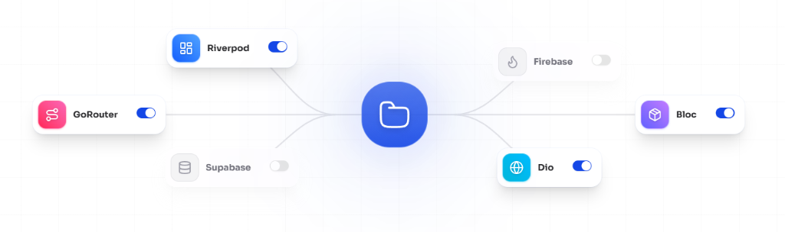

<!--
  PREMIUM OPEN SOURCE README
  Designed with Antigravity 🚀
  Theme: Refined Digital Architecture
-->

<div align="center">
  
  
  <br />

  
  <h1><b>Flutter Init</b></h1>
  <p><i>The High-Performance Scaffolding Engine for Modern Flutter Apps</i></p>

  <p>
    <a href="https://github.com/Arjun544/flutter_init/stargazers"></a>
    <a href="https://github.com/Arjun544/flutter_init/network/members"></a>
    <a href="https://flutterinit.com/"></a>
    <a href="https://github.com/Arjun544/flutter_init/blob/main/LICENSE"></a>
  </p>

  <br />

  
</div>

---

## 🏛️ The Architecture of Speed

**Flutter Init** is an open-source project designed to eliminate the "initial drag" of Flutter development. It provides a highly opinionated yet flexible scaffolding system that maps your architectural vision to a production-ready codebase in seconds.

### 🎯 Why use Flutter Init?
- **Elite Quality**: Follows `flutter_lints` and SOLID principles by default.
- **Extreme Speed**: From a blank screen to a running app with routing & state in < 60s.
- **Enterprise DNA**: Pre-configured with logging, error handling, and environment management.

---

## ✨ Features (Elevated)

<table border="0">
  <tr>
    <td width="50%" valign="top">
      <h3>🚀 Zero Boilerplate</h3>
      <p>Forget the 4-hour setup. We generate the folder structure, base classes, and core utilities so you can focus on building features.</p>
    </td>
    <td width="50%" valign="top">
      <h3>🏗️ Architecture First</h3>
      <p>Optimized for Clean Architecture, MVVM, and Feature-First structures. The engine adapts to your team's mental model.</p>
    </td>
  </tr>
  <tr>
    <td width="50%" valign="top">
      <h3>🎨 Design System Ready</h3>
      <p>Material 3 tokens, dark mode support, and responsive scaling (via ScreenUtil) are baked into every scaffold.</p>
    </td>
    <td width="50%" valign="top">
      <h3>⚙️ Industrial Strength</h3>
      <p>Includes a custom CLI and Web Dashboard for managing your project lifecycle from initialization to deployment.</p>
    </td>
  </tr>
</table>

---

## ⚡ Quick Start

### CLI Installation
```bash
# Clone the repository
git clone https://github.com/Arjun544/flutter_init.git

# Install dependencies
npm install

# Start the interactive UI
npm run dev
```

<details>
<summary><b>View Advanced Setup Options</b></summary>

- **Custom Root Directory**: `--root <path>`
- **Skip Interactive Mode**: `--yes`
- **Output JSON Log**: `--json`

</details>

---

## 🤝 Contribution-Based Growth

This repository is built on the principle of **Contribution Based Evolution**. We don't just want users; we want architects.

- **Submit Patterns**: Add your favorite architectural patterns to our `templates/` directory.
- **Refine the Core**: Improve the Web Dashboard UI.
- **Developing Templates**: Learn how to test and debug templates in real-time. [Read the Dev Guide](docs/template-development.md).
- **Documentation**: Help us make the onboarding experience even smoother.

> [!TIP]
> Every contributor who gets a PR merged receives a special place in our contributors' hall of fame.

---

## 🛠️ Built By

<div align="center">
  <a href="https://github.com/Arjun544">
    
    <br />
    <b>Arjun544</b>
  </a>
  <p><i>Founder & Lead Architect</i></p>
</div>

---

<p align="center">
  
  
  
</p>

<div align="center">
  <p>© 2026 Flutter Init Project. Released under the MIT License.</p>
</div>
